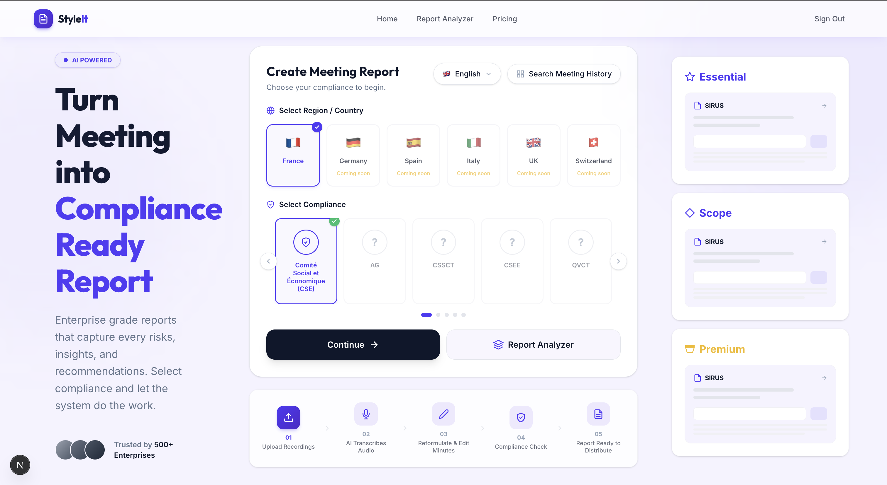
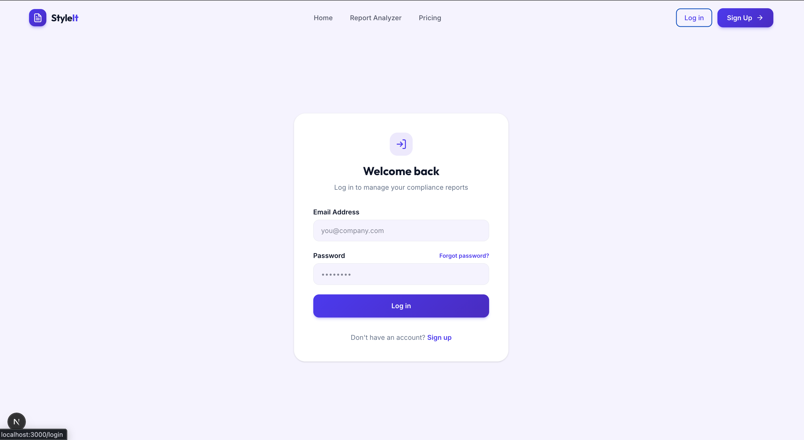
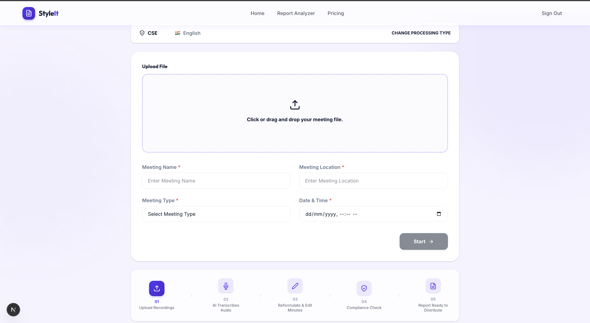
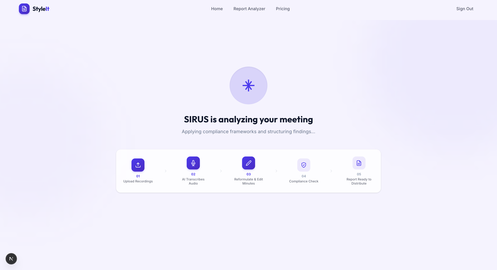
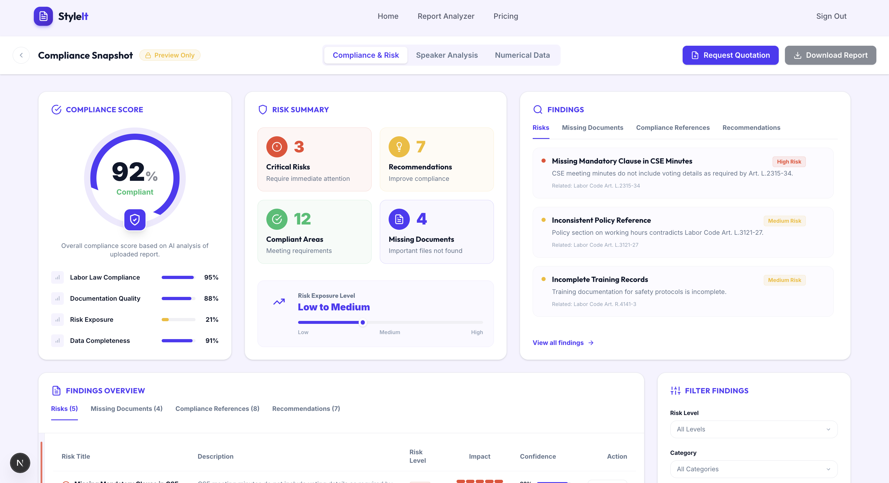
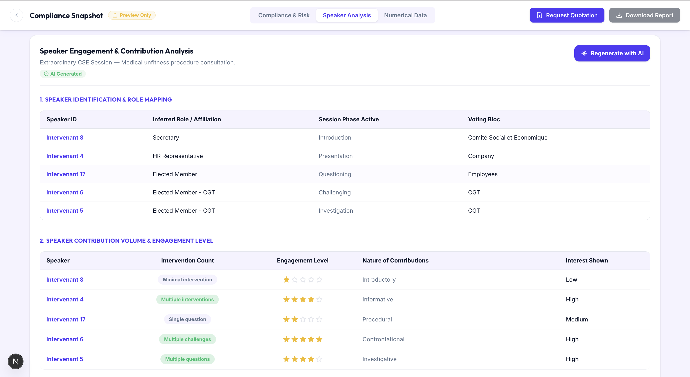
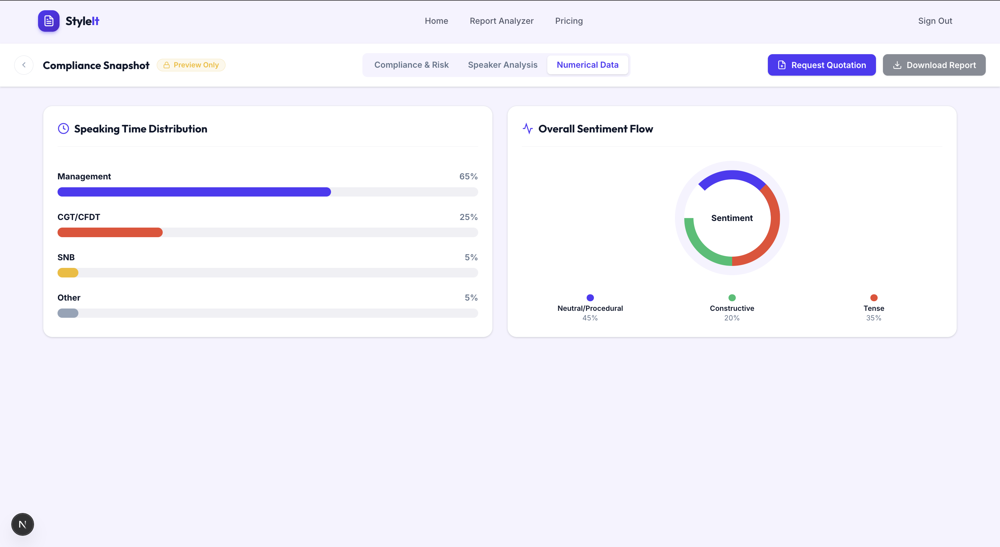
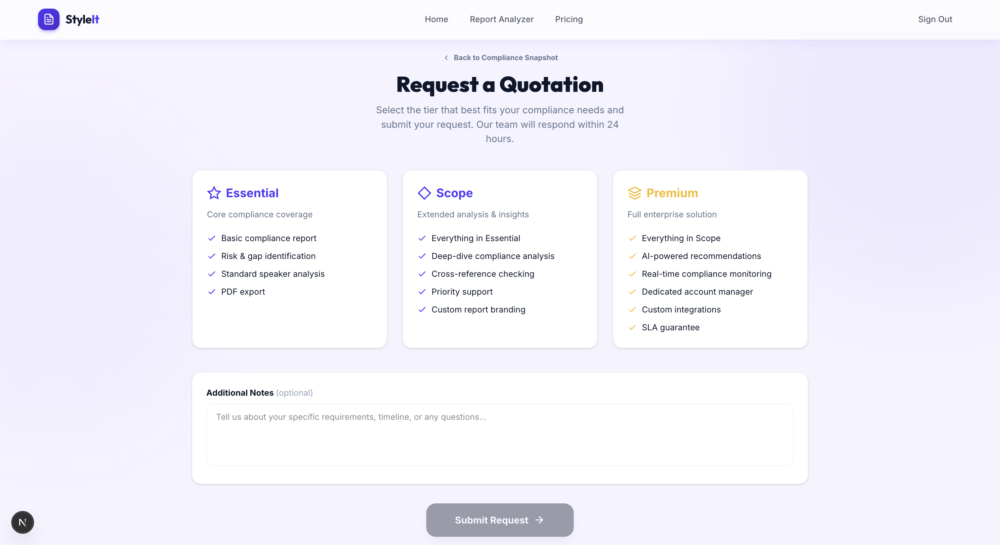
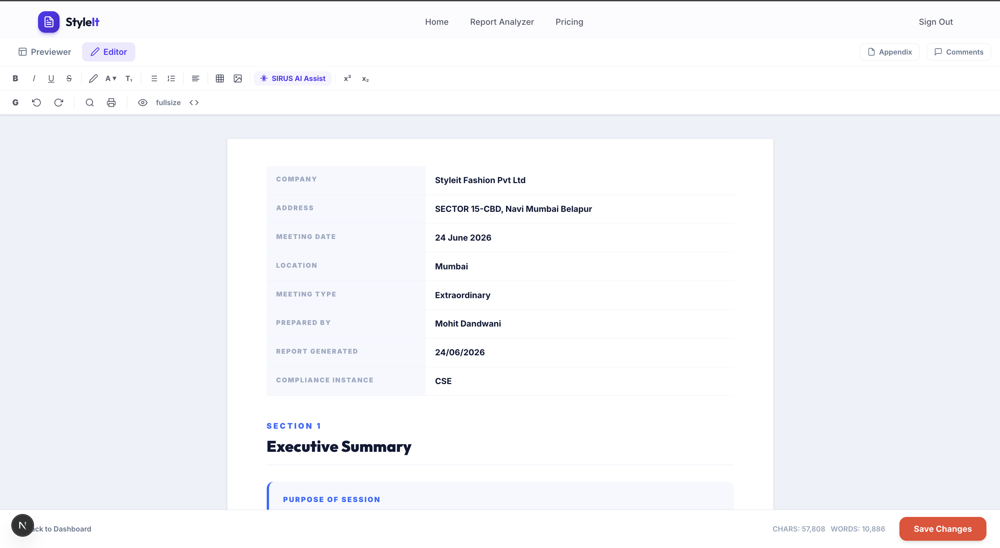
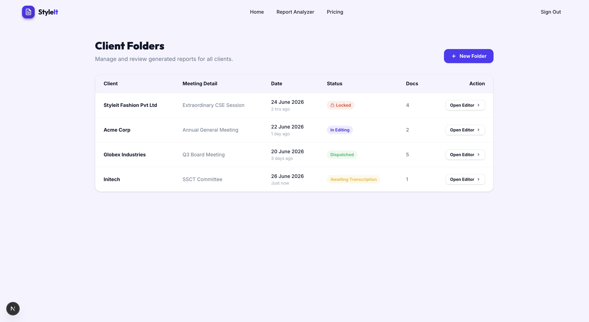

# SIRUS — AI-Powered Compliance Reporting Platform

A high-fidelity, production-grade frontend prototype for an AI-driven compliance meeting analysis and report generation tool. Built with **Next.js 16**, **React 19**, and **Tailwind CSS 4**.

> This prototype was built as part of a technical assessment to demonstrate frontend engineering proficiency, product design sense, and the ability to integrate real AI capabilities into a modern web application.

---


### 1. Landing Page — Hero & Marketing (`/`)

The entry point of the application. Features a bold hero section with the product tagline, an animated gradient background, and a clear call-to-action. Below the fold, three interactive **Tier Cards** (Essential, Scope, Premium) showcase the different service levels with mock report thumbnails inside each card. Further down, the **Before/After block** visually demonstrates how raw meeting transcripts are transformed into polished compliance reports — a key value proposition for the product.



---

### 2. Login & Signup (`/login`, `/signup`)

Clean, minimal authentication pages with a centered card layout, email/password fields, and social login placeholders. The login system uses a simple cookie-based session (`sirus_session`) — no real backend auth is needed, but the flow is fully functional. Logging in sets the cookie and redirects to the main application; logging out clears it.



---


### 3. Upload Step (`/upload`)

The file upload interface. At the top, a **Confirmed Selection Bar** displays the chosen compliance type and language from the previous step (e.g., "CSE · English") with a "Change Processing Type" link back.

The main area features:
- A **drag-and-drop zone** with visual feedback (border color change, icon animation) on hover/drop.
- **4 required text fields**: Meeting Title, Organizer, Date, and Location.
- A **"Start Processing" button** that remains disabled until at least one file is selected and all 4 fields are filled — this prevents accidental empty submissions.



---

### 4. AI Processing Animation (`/processing`)

**Creative Addition #1.** Instead of a generic loading spinner, we built a branded animated transition that turns the "AI is working" dead time into an intentional product moment.

The page reuses the 5-step `StepTracker` component from the Metadata step, but this time each stage lights up in sequence with smooth transitions:
1. Select Type ✓ → 2. Upload ✓ → 3. Processing (pulsing) → 4. Review → 5. Complete

Each step auto-advances after ~1.5 seconds, creating the illusion of a real backend pipeline at work. After all 5 steps complete, the user is automatically redirected to the Analyzer Dashboard.



---

### 5. Analyzer Dashboard — Compliance & Risk Tab (`/analyzer`)

The centerpiece of the application. This is a complex, data-rich dashboard that presents the AI-generated compliance analysis.

**Header:** Features a "PREVIEW ONLY" badge (indicating the report hasn't been purchased yet), three navigation tabs, a purple **"Request Quotation"** button (links to `/quotation`), and a disabled "Download Report" button.

**Compliance & Risk Tab contents:**
- **Overall Score Ring** — A pure CSS-based circular chart showing 92% compliance, with the score rendered using `conic-gradient`.
- **Risk Summary Tiles** — Three cards (High Risk Findings, Medium Risk, Compliance Score) with colored indicators.
- **Risk Exposure Level** — A horizontal slider/track visualization showing the overall risk position.
- **Findings Table** — A detailed data table listing each compliance finding with dynamically rendered Impact and Confidence bars (CSS width percentage), category pills, and severity indicators.
- **Filter Sidebar** — Allows filtering findings by category (Regulatory, Procedural, etc.).
- **Risk Minimap (Creative Addition #2)** — A slim vertical strip on the left edge of the findings table. Each colored block represents a finding, colored by category (red, amber, green, purple). This provides an at-a-glance visual scan of the risk distribution without reading every row.



---

### 6. Analyzer Dashboard — Speaker Analysis Tab (`/analyzer`)

This tab presents the AI-extracted speaker engagement data from the meeting transcript. It contains three tables:

1. **Speaker Identification & Role Mapping** — Maps each speaker ID (e.g., "Intervenant 4") to their inferred role, the session phase they were active in, and their voting bloc affiliation.
2. **Engagement Level** — Shows intervention counts, a 5-star engagement rating rendered with filled/unfilled SVG stars, the nature of each speaker's contributions, and their interest level.
3. **Summary Scorecard** — A quantitative breakdown per speaker across 4 dimensions (Volume, Quality, Power, Impact) with an overall score out of 20.

**🤖 "Regenerate with AI" Button** — This is where the real AI integration lives. Clicking this button triggers a POST request to `/api/generate-analysis`, which sends a hardcoded CSE meeting transcript excerpt to the **Groq API** (using the `llama-3.3-70b-versatile` model). The LLM processes the transcript according to a strict system prompt and returns a structured JSON object containing the roles, engagement levels, and scorecard. The UI then dynamically re-renders all three tables with the AI-generated data and shows a green "AI Generated" badge. If no API key is configured, it gracefully falls back to the mock data.



---

### 7. Analyzer Dashboard — Numerical Data Tab (`/analyzer`)

A visual summary tab built entirely with CSS (no charting library). Contains:
- **Speaking Time Distribution** — Horizontal bar chart showing percentage breakdown per speaker, with colored bars proportional to their speaking time.
- **Overall Sentiment Flow** — A donut chart rendered with `conic-gradient`, showing the distribution of Neutral, Assertive, Collaborative, Confrontational, and Procedural sentiments across the meeting.



---

### 8. Quotation Request Flow (`/quotation`)

The conversion step. After previewing the compliance report, users can request a full report by selecting a service tier.

**Form State:**
- Three side-by-side **Tier Cards** (Essential, Scope, Premium) — each with a feature checklist. Selecting a card highlights it with a colored border and a floating checkmark badge.
- A **Notes textarea** for additional requirements.
- A **"Submit Request"** button that is disabled until a tier is selected.

**Confirmation State:**
After submission, the page transitions to a success screen with an animated bouncing green checkmark, a "Request Sent to Our Team" message, a receipt card summarizing the selected tier and notes, and a "Back to Dashboard" link.



---

### 9. Document Editor (`/editor`)

A rich document editing interface matching the reference screenshot `05`. Built as a visual shell (the formatting buttons are rendered but not wired to a real rich-text engine like Tiptap, since adding that dependency was out of scope).

**Previewer / Editor Toggle** — The top-left tabs switch between a clean read-only preview and the full editor with toolbar.

**Toolbar (Editor Mode):**
- Row 1: Bold, Italic, Underline, Strikethrough, font color, text size, heading controls.
- Row 2: Bullet/numbered lists, alignment, table insertion, image insertion, **"SIRUS AI Assist"** button, superscript/subscript.
- Row 3: Undo/Redo, Search, Print, Eye (preview), fullsize, code view toggle.

**Content Pane:** The report is rendered using CSS classes extracted directly from the `Report_Design_Template Blue.html` reference file:
- `.kv-table` — The meeting metadata table (Company, Address, Date, Location, etc.).
- `.exec-card` — The Executive Summary callout with a blue left-border accent.
- `.data-table` — Striped attendance record table with dark header.
- `.speaker` — Discussion log bubbles with avatar badges and role-colored borders.
- `.alert-tension`, `.alert-unresolved`, `.alert-decision` — Color-coded callout blocks for key meeting moments.

**Footer:** Displays character and word counts (CHARS: 57,808 / WORDS: 10,886) and a red **"Save Changes"** button that shows a ✓ "Saved!" confirmation on click.



---

### 10. Admin Panel (`/admin`)

An internal-facing page for managing client report folders.

- **Client Folders Table** — Lists mock clients (Styleit Fashion, Acme Corp, Globex Industries, Initech) with their meeting types, dates, and last activity timestamps.
- **Status Pills** — Dynamically colored badges representing the document workflow:
  - 🟡 **Awaiting Transcription** (amber)
  - 🟣 **In Editing** (purple/primary)
  - 🔴 **Locked** (red, with a lock icon)
  - 🟢 **Dispatched** (green)
- **"Open Editor"** action button on each row links to the Document Editor (`/editor`).
- **"New Folder"** button in the top-right (visual only).



---

## 🏗️ Tech Stack

| Layer | Technology |
|-------|-----------|
| **Framework** | Next.js 16 (App Router, Turbopack) |
| **UI** | React 19, TypeScript |
| **Styling** | Tailwind CSS 4 with custom design tokens |
| **AI Integration** | Groq API (Llama 3.3 70B Versatile) |
| **Deployment** | Static export ready, Vercel compatible |

---

## 🚀 Getting Started

### Prerequisites
- **Node.js** 18+ installed
- **npm** (comes with Node.js)

### Installation

```bash
# Clone the repository
git clone https://github.com/sammy200-ui/style-it-fashion.git
cd style-it-fashion

# Install dependencies
npm install

# Start the development server
npm run dev
```

Open [http://localhost:3000](http://localhost:3000) in your browser.

### Setting Up the AI Integration (Optional)

To enable the real AI-powered speaker analysis regeneration:

1. Create a free account at [console.groq.com](https://console.groq.com).
2. Generate an API key from the Groq dashboard.
3. Create a `.env.local` file in the project root (use `.env.example` as reference):
   ```
   GROQ_API_KEY=gsk_your_actual_api_key_here
   ```
4. Restart the dev server (`Ctrl+C` then `npm run dev`).
5. Navigate to `/analyzer` → Speaker Analysis tab → click **"Regenerate with AI"**.

---

## 🧠 Architecture: What's Mocked vs. What's Real

### Mocked (Static Data Fixtures)
The majority of the application uses hardcoded data to ensure a fast, reliable, and visually perfect demo experience:

- **Compliance & Risk Dashboard** — All findings, scores, and risk data come from `lib/mock-data/analyzer.ts`.
- **Speaker Analysis** — Default view uses the same mock data file (extracted from the `speaker analysis report.pdf` reference).
- **Numerical Data Tab** — Hardcoded speaking time percentages and sentiment distribution.
- **Upload & Processing Flow** — The file upload accepts real files but doesn't process them. The processing animation is a timed sequence.
- **Authentication** — Cookie-based session with no real backend verification.
- **Admin Panel** — Static list of client folders with mock statuses.
- **Document Editor** — Content is hardcoded; formatting toolbar buttons are visual-only.

### Real (Live AI Integration)
The **"Regenerate with AI"** button on the Speaker Analysis tab triggers an actual API call:

1. The frontend sends a POST request to `/api/generate-analysis`.
2. The API route takes a **hardcoded raw transcript excerpt** (a real CSE meeting discussion about medical unfitness proceedings).
3. It sends the transcript to the **Groq API** using the `llama-3.3-70b-versatile` model with a strict system prompt.
4. The LLM returns a structured JSON object containing:
   - Speaker role mappings
   - Engagement levels (1–5 scale)
   - A summary scorecard (Volume, Quality, Power, Impact — each /5, overall /20)
5. The UI dynamically re-renders all three tables with the AI-generated data and shows an "AI Generated" badge.
6. If the API key is missing or the call fails, the system gracefully falls back to the mock data — ensuring the demo never breaks.

This architecture demonstrates the ability to integrate real AI while maintaining a bulletproof demo experience.

---

## 📁 Project Structure

```
style-it-fashion/
├── app/
│   ├── admin/page.tsx          # Client folder management
│   ├── analyzer/page.tsx       # Compliance dashboard (3 tabs)
│   ├── api/generate-analysis/  # Groq LLM API route
│   ├── editor/page.tsx         # Document editor/previewer
│   ├── login/page.tsx          # Login page
│   ├── processing/page.tsx     # AI pipeline animation
│   ├── quotation/page.tsx      # Tier selection + confirmation
│   ├── signup/page.tsx         # Registration page
│   ├── upload/page.tsx         # File upload step
│   ├── page.tsx                # Landing page (marketing + metadata)
│   ├── layout.tsx              # Root layout with Navbar
│   └── globals.css             # Global styles + Tailwind imports
├── components/
│   ├── analyzer/               # Dashboard tab components
│   ├── layout/Navbar.tsx       # Navigation bar
│   ├── marketing/              # Hero, Before/After blocks
│   ├── steps/                  # MetadataStep, UploadForm
│   └── ui/                     # StepTracker, TierCard
├── lib/mock-data/analyzer.ts   # All mock data fixtures
├── styles/
│   ├── tokens.css              # Design system CSS variables
│   └── editor.css              # Report template classes
├── public/
│   ├── reference/              # Original design screenshots & templates
│   └── screenshots/            # Your screenshots (add here)
└── .env.example                # Environment variable template
```

---

## 🎨 Design System

The application uses two distinct visual systems, as specified in the project brief:

**Product/App UI** (Landing, Upload, Dashboard, Editor chrome):
- `--primary: #4F39F6` (indigo-violet for buttons, active states)
- `--ink: #101936` (near-black for headings)
- `--bg-app: #F7F8FC` (soft off-white background)
- Full token set defined in `styles/tokens.css`

**Report Content** (inside the Document Editor):
- `--report-accent: #2F69FF` (brand blue from the Blue Template)
- `--report-accent-dark: #101936` (navy headings)
- Scoped under `.report-content` wrapper in `styles/editor.css`
